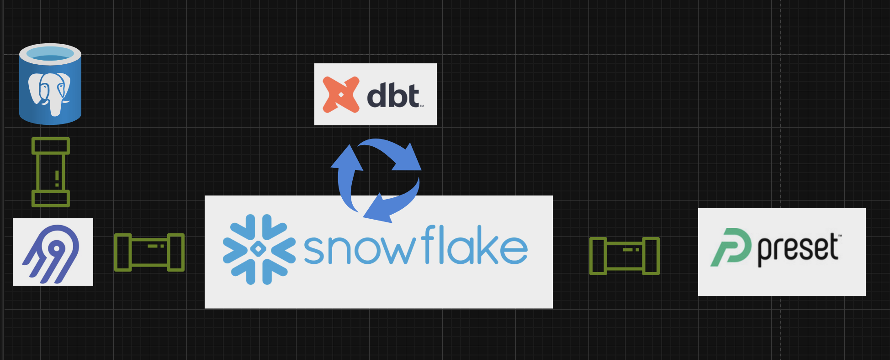

# DVD_RENTAL ELT Pipeline

This project contains an end-to-end pipeline for the `dvd_rental` sample database. It:
- extracts data from a local database using Airbyte
- loads the raw data into Snowflake
- applies a series of transformations using dbt, including the creation of fact and dimension tables, and
- creates a couple of views for analytics use

To run this code locally:
1. [Download the sample database](https://www.postgresqltutorial.com/postgresql-getting-started/postgresql-sample-database/) and load it into your local Postgres instance.
2. Run `make get-airbyte` from root to download the airbyte repo. `cd` into the repo and run `./run-ab-platform.sh` to run airbyte locally on docker.
3. Navigate to `localhost:8000` and [set up a source](https://docs.airbyte.com/integrations/sources/postgres) and [a destination](https://docs.airbyte.com/integrations/destinations/snowflake) in order to extract the `dvd_rental` database from your local postgres instance into your data warehouse.
4. Once your data exists in your data warehouse, you can update your dbt settings to reflect the necessary credentials, and then `cd` into the `transformation` directory to apply the transformatinos using `dbt run`.

